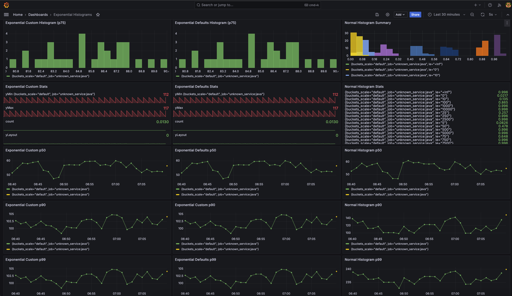

# Exponential Histogram Example

## Context

Lab environment to experiment with OpenTelemetry Exponential Histograms.

Additional References:

* [OTel Documentation for the ExponentialHistogram Data model](https://opentelemetry.io/docs/specs/otel/metrics/data-model/#exponentialhistogram)
* [OTel Documentation for Histogram Aggregations](https://opentelemetry.io/docs/specs/otel/metrics/sdk/#histogram-aggregations)
* [Exponential Histograms: Better Data, Zero Configuration](https://opentelemetry.io/blog/2022/exponential-histograms/) 2022 Blog post by Jack Berg
    * [Code example associated with the blog post by Jack Berg](https://github.com/jack-berg/newrelic-opentelemetry-examples/commit/2681bf25518c02f4e5830f89254c736e0959d306)

This lab has a simple program written in Kotlin that uses the OpenTelemetry java SDK to create 3 histograms, and then 
using views, leverage the Exponential Histogram functionality for 2 of the metrics. The metrics are exported over gRPC to 
`the OTel collector -> prometheus -> grafana` where they can be visualized.


## Run lab

Uses the [grafana/otel-lgtm](https://grafana.com/blog/2024/03/13/an-opentelemetry-backend-in-a-docker-image-introducing-grafana/otel-lgtm/) container 
to spin up all the observability tools (OTel collector, prometheus, grafana)

`docker compose up -d`

@TODO: containerize app

Access Grafana:

```
http://localhost:3000/
```

Navigate to `Dashboards` -> [`Exponential Histograms`](http://localhost:3000/d/fdj5lsyfzhatcc/exponential-histograms?orgId=1&refresh=5s)

